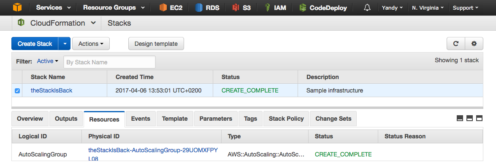
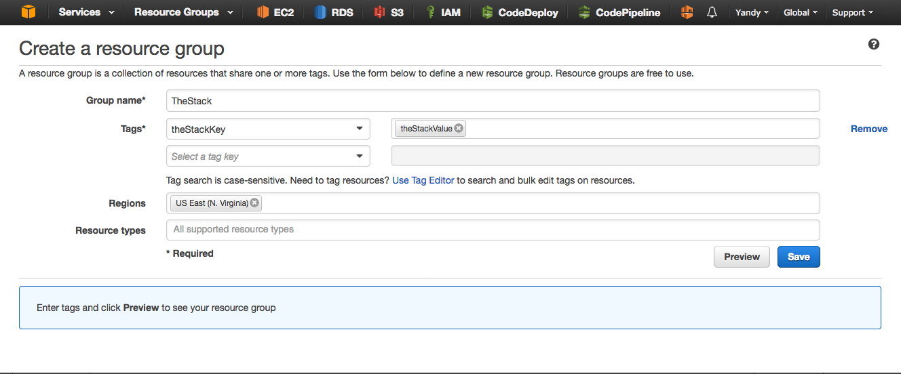
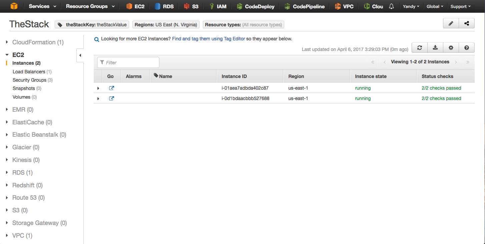

## The basic infrastructure in only five minutes
As a first step, we will set up the basic infrastructure. 


## Infrastructure 


## Description
The basic infrastructure contains the following AWS resources:

- *Elastic Load Balancing (ELB)* used to distribute the traffic to the web servers behind it.
- *Elastic Compute Cloud (EC2)*, two virtual Linux servers called Amazon Linux.
- *Relational Database Service (RDS)* providing a MySQL database.

## Quick Start
1. [Create an IAM User and setup the aws cli](http://docs.aws.amazon.com/cli/latest/userguide/cli-chap-getting-set-up.html)
1. Create a key called "keyToSuccess" in the [AWS Managment Console](https://console.aws.amazon.com/console/home) -> EC2 -> Key Pairs -> *Create Key Pair*
1. [Download the template](../../templates/stack_basic/template_basic_stack.json)
1. Open a terminal and insert the following command: 
```
aws cloudformation create-stack --region us-east-1 --stack-name theStackIsBack --tags Key=theStackKey,Value=theStackValue --template-body file:///pathToTemplate/template_basic_stack.json --parameters ParameterKey=KeyName,ParameterValue=keyToSuccess ParameterKey=DBName,ParameterValue=TheDbName ParameterKey=DBPwd,ParameterValue=Th3P455w0rd ParameterKey=DBUser,ParameterValue=TheDbUser --capabilities CAPABILITY_IAM
```

## Exploring the infrastructure in the AWS Managment Console

1. Go to [https://aws.amazon.com/console/](https://aws.amazon.com/console/) and log in.
1. Under *Services* select *CloudFormation*. If the infrastructure was successfully created you will see CREATE_COMPLETE in the Status column.
<br/><br/>

<br/><br/>
1. Under *Resource Groups* select *Create a Reource Group*. In *Group name* enter the name you like. In *Tags* enter **theStackKey** and **theStackValue**. In *Regions* enter **US East(N. Virginia)** and click *Save*. 
<br/><br/>

<br/><br/>
1. On the left side menu you will find the created resources.
<br/><br/>

<br/><br/><br/><br/>


**Next: [Description of the basic template](../../documentation/basic_stack/template_desc.md)**