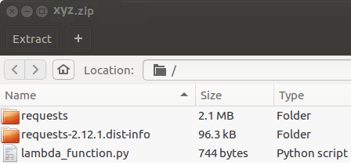

# Amazon AWS - How To
I explain every step so that it can made with the least of effort. If you follow this manual, each thing we setup will be in a basic state. The goal is, to provide a step by step manual where everyone can follow on how to set up some of the AWS services.

## The most common services:
* **EC2:** Server, on which the deployed applications run.
* **Elastic Beanstalk:** An envoirement to create and manage deployed applications.
* **S3:** Online Storage for files
* **Lambda:** Scheduled Jobs or scripts that run on certain events.
* **CloudFront:** Optional Entry-Point (UseCase: Fend off DDOS attacks).
* **RDS:** Environment to manage and setup a databse
* **Route 53:** Buy and manage domains.
* **IAM:** Define roles having different priviledges.
* **Certificate Manager:** Get trusted certificates for your domain (enable SSL, HTTPS)

## How to deploy a Java Webserver:
1. Open *Elastic Beanstalk*
1. *Create New Application*
1. Insert the name of your Application (the naming is a bit diffusing at this point, since *Application* does no mean a single instance of something. It is more or less a container for 1-* applications)
1. *Actions* -> *Create New Environment* -> *Web Server Environment* (an *Environment* is understood as single application. If you run one instance of your app as *PROD* and one as *DEV*, each will have it's own environment, while they are in the same *Application*-Container)
1. *Platform* -> Java
1. Select *Upload your code* and upload your jar/war file
1. Your program is now running successfully. You can access it through the domain created by Elastic Beanstalk (subdomain.region.elasticbeanstalk.com)
1. The following resources were created: EC2 Instance, Security Group, Auto Scaling Group, Amazon S3 bucket, Amazon CloudWatch alarms and a domain name
1. Further steps: Set up a load balancer, set up a "Route 53"-Domain to point to the load balancer.

## Using Lambdas to run scheduled jobs
This chapter assumes that you have a rest server where you want to trigger some routines.

1. Open the lambda section on AWS.
1. Click on *Create a Lambda Function*
1. *Name* / *Description* -> Write any name/Description.
1. (I highly recommend to use Python for this usecase. Java 8 is supported. Use a *lambda-canary* Blueprint for this.) Select *runtime* -> *python*
1. «Code entry type» -> *Upload a zip file* select a zip file containing your code. Now, it is very important to have the right structure! Your Zip-File must contain the main python-script at root level. Package all the external libraries, that aren't part of python-2.7 at root level too. Your structure should then look something like this:

1. OPTIONAL: The method suitable for a http call looks like that:

1. Define Environment Variables if you need any.
1. Handler: It is important, that this field contains the exact naming of what you call. If you have a file called "My_ExteremlyNiceScript.py" and you want to call the function "haveSomeBalls_ToDoTheRestCalls", you need to write "My_ExteremlyNiceScript. haveSomeBalls_ToDoTheRestCalls" into the text field.
1. *Role*: If you aren't familiar with roles, just choose *Use an existing Role* and choose *service-role/admin* in the *Existing Role* field.
1. You can leave the advanced setting be for now.
1. Click *Next* and *Create Function*.
1. Click test and choose any input, then click *Save and Test*. If you use the input from the method parameters within your method, you should see that the input matches your desire.
1. You will get a red borderer message if it failed or a green bordered message if the script compiled and runned successfully.

## Create a SonarQube EC2 instance:
### Create database instance and user
Go to RDS > Parameter Groups
Create a new Parameter Group with the following parameter:
*max_allowed_packet = 268435456*
We need to create a new RDS database for SonarQube (you may use an existing MySQL instance)

1. Go to RDS Instances
1. Launch a new DB instance
1. Select MySQL
1. Define your master username and password

### Run SonarQube as EC2 Container
Let's create a new container for SonarQube and add it to ELB load balancer to make it easily accessible

1. Go to EC2 Container Service
1. *Create a new cluster*
1. On cluster details page, switch to *Task Definitions*
1. Create new Task Definition:
1. Give it a name (eg. SonarQube)
1. Set task tole to None
1. Select Bridge Network mode
1. Add a container Container name: SonarQube
1. Image: sonarqube:latest
1. You may want to add memory limit. Minimum 1024MB is recommended.
1. Ports: 9000 -> 9000
>Add environmend varialbes:
SONARQUBE_JDBC_USERNAME = admin
SONARQUBE_JDBC_PASSWORD = admin
SONARQUBE_JDBC_URL = jdbc:mysql://YOUR_DB_PUBLIC_DNS_LINK:3306/sonar?useUnicode=true&characterEncoding=utf8&rewriteBatchedStatements=true

Once the task is defined, it's time to create the ELB:

1. Got to EC2 Dashboard -> Load Balancers
1. Create a new Load Balancer
1. Select the "Classic Load Balancer"
1. Give it a name (eg. SonarQubeELB)
1. Select a proper VPC subnet (should be the same as your ECS Cluster)
1. Then load balance the HTTP protocol port 80 to Instance Port: 9000
1. Add the right availability zone
1. Define Health Check HTTP:9000 (you may want to test HTTP:9000/images/favicon.ico)
1. Finally, we have to create a new Service based on out task defined earlier and add it to the ELB we just created.
1. Go back to EC2 Container Service
1. Select your cluster
1. Create a new Service
1. Select SonarQube as task definition, give your service a name
1. Number of tasks will be set to 1
1. Then click on *Configure ELB*
1. Select the Classic Load Balancer
1. Select the SonarQubeELB you created
1. Save

Once the service will start the task and become ACTIVE , you will see your SolarQube up and running. It can be accessed by the DNS name of the load balancer. Make sure to change the default login as you don't want any strangers lurking on your instance.

### (Optional) Scan a java gradle project:
Add the following lines to the top of your build.gradle file:

>plugins {
    id "org.sonarqube" version "2.2.1"
}
sonarqube {
    properties {
        property "sonar.projectName", "NAME_OF_YOUR_PROJECT"
        property "sonar.projectKey", "org.sonarqube:java-gradle-simple"
        property "sonar.host.url", "http://YOUR_DOMAIN.COM"
        property "sonar.login", "admin"
        property "sonar.password", "admin"
    }
}

After you did that, go to the terminal and execute the command "gradle sonarqube". This will run the build including tests and deploy the results to your Sonarqube instance.

## Domain-Handling
### Register a domain 
1. Go to the *Route 53* Section.
1. Register a domain.
1. Go to *Hosted Zones*, select your domain
1. You will now see 3 records. Do NEVER delete them. You can change the one of type A to redirect visitors to your target.

### Register a Subdomain
1. Click on *Create Record Set*
1. Add the name of your desired subdomain into the *Name* Field on the right.
1. The *Type* is mostly *A - IPv4 Address*.
1. Click on the *Alias - Yes* radio button.
1. Type in your custom target or link one of your beanstalks, S3s and so on. A custom target would look like this: "google.ch/ljansdlknasdjhalsd"
1. *Routing-Policy*: Simple
1. *Evaluate Target Help*: No
1. Click on *Save Record Set*

### Register a certificate
1. In the AWS Console, click on *Services* -> *Certificate Manager*
1. *Request a Certificate*
1. Type in your domain, example: example.com
1. Request the certificate
1. React to the mail you get

### Use the certificate for your application
1. Go to the EC2 Dashboard
1. Click on *Load Balancers*, select the load balancer for your EC2 instance
1. In the load balancer overview, click on the *Listeners* tab.
1. *Add* -> *Load Balancer Protocol*: HTTPS, *Instance Port* 80, *SSL Certificate* -> *Choose an existing certificate from AWS Certificate Manager (ACM)* -> The certificate you requested (if it doesn't show up, the certifficate may not have been approved)
1. *Save*

## FAQ:
(HTTP 500, Internal Server Error) My backend is unable to access another aws service, while it works locally on my computer.
It could be that an IAM role was defined which doesn't have the permission to the other service. Go to *Services* -> *IAM* -> And search for the role that is being used by the backend (normally you can see it in the error-message delivered with the error). Go to *Roles* and click on the appropriate role. Click on *Attach Policy* and give full access to the appropriate service (easiest way).

