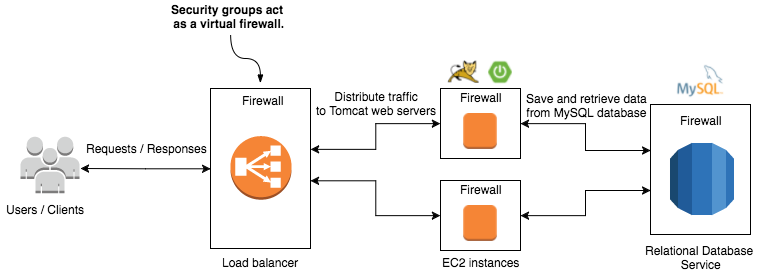

# How to properly setup a Spring Boot Application using CloudFormation
## Intro
The goal of this project is to give you a rocket start into AWS CloudFormation. It should lead you through the process of setting up a backend for yourself in only minutes. Adapting the template to other stacks/technologies should be as easy as possible. The focus lays on scalability and security. 

We are building a Spring Boot RESTful backend here using only AWS CloudFormation. We include a MySql database, to which our application automatically connects to.

We are always happy to get your support. If you find anything that could be better, we highly appreciate your feedback. :)

## Infrastructure


## How to start asap?
1. [Create an IAM User and setup the aws cli](http://docs.aws.amazon.com/cli/latest/userguide/cli-chap-getting-set-up.html)
1. Create a key called "keyToSuccess" in the [webinterface](https://console.aws.amazon.com/console/home) -> EC2 -> Key Pairs -> *Create Key Pair*
1. Open a terminal and insert: 
```bash
aws cloudformation create-stack --region us-east-1 --stack-name theStackIsBack --template-body file:///Users/PATH_TO_TEMPLATE/template.json --parameters ParameterKey=KeyName,ParameterValue=keyToSuccess ParameterKey=DBName,ParameterValue=TheDbName ParameterKey=DBPwd,ParameterValue=Th3P455w0rd ParameterKey=DBUser,ParameterValue=TheDbUser
```
1. Done

## Description
For building the infrastructure we will use four different AWS services:

- *Elastic Load Balancing (ELB)* used to distribute the traffic to the web servers behind it.
- *Elastic Compute Cloud (EC2)*, two virtual Linux servers called Amazon Linux. The Tomcat web server and Spring Boot application will be installed on each virtual server.
- *Relational Database Service (RDS)* providing a MySQL database. The Spring Boot application relies on this database. 
- *Security groups* used to control the network traffic like firewall. With security groups, we will configure the load balancer so that it only accepts request on port 443 from the internet, the virtual servers accept connections from outside on port 22 (SSH) and connections on port 8080 only from the load balancer. MySQL only accepts connections on port 3306 from the virtual servers.
- *VPC* to keep instances accessible only by each other or by the load balancer.

## CloudFormation Template
A template is a JSON or YAML formatted text file that describes the AWS infrastructure. We will use  the JSON format for building our infrastructure.
A template provides the following advantages:

- Create a complete stack
- Keep everything in a single template
- Replace components/resources as updates without losing data (auto-migration)
- Custom parameters (environment variables)
- Manage deployments
- Manageable over the cli or the webinterface


## Main sections

The template is divided into several sections.

```json
{
	"AWSTemplateFormatVersion": "2010-09-09",
	"Description": "Sample Infrastructure",
	"Parameters": {...},
	"Metadata" : {...},
	"Mappings": {...},
	"Resources": {...},
	"Outputs": {...}
}
```

#### Format Version
Specifies the AWS CloudFormation template version that the template conforms to.

#### Description
A custom description you can write for your project.

#### Parameters
Specifies values that you can pass in to the template at runtime (when you create or update a stack). Those can be handed over as json file or over the console.

#### Metadata
Contains objects that provide additional information about the template. 

Here we use the AWS::CloudFormation::Interface metadata key that defines how parameters are grouped and sorted in the AWS CloudFormation console. We create the group *Database Configuration* and specifies that the parameters  *DBName*, *DBUser*, *DBPwd* should be displayed in that order. Finally we define de group *EC2 Key Pair*.

```json
{
	...
	"Metadata" : {
      "AWS::CloudFormation::Interface" : {
        "ParameterGroups" : [
          {
            "Label" : { "default" : "Database Configuration" },
            "Parameters" : [ "DBName", "DBUser", "DBPwd"]
          }
          ,{
            "Label" : { "default" : "EC2 Key Pair" },
            "Parameters" : ["KeyName"]
          }
        ]
      }
    },
	...
}
```

#### Mappings
Matches a key to a corresponding set of named values.

Here we define a map EC2RegionMap, which contains different keys (region names). Each key contains a name-value pair representing the [AMI](http://docs.aws.amazon.com/AWSEC2/latest/UserGuide/AMIs.html) ID for the AMI Name in the region represented by the key.

```json
{
	...
	"Mappings": {
		"EC2RegionMap": {
			"ap-northeast-1": {"AmazonLinuxAMIHVMEBSBacked64bit": "ami-cbf90ecb"},
			"ap-southeast-1": {"AmazonLinuxAMIHVMEBSBacked64bit": "ami-68d8e93a"},
			"ap-southeast-2": {"AmazonLinuxAMIHVMEBSBacked64bit": "ami-fd9cecc7"},
			"eu-central-1": {"AmazonLinuxAMIHVMEBSBacked64bit": "ami-a8221fb5"},
			"eu-west-1": {"AmazonLinuxAMIHVMEBSBacked64bit": "ami-a10897d6"},
			"sa-east-1": {"AmazonLinuxAMIHVMEBSBacked64bit": "ami-b52890a8"},
			"us-east-1": {"AmazonLinuxAMIHVMEBSBacked64bit": "ami-1ecae776"},
			"us-west-1": {"AmazonLinuxAMIHVMEBSBacked64bit": "ami-d114f295"},
			"us-west-2": {"AmazonLinuxAMIHVMEBSBacked64bit": "ami-e7527ed7"}
		}
	},
	...
}
```

#### Resources
The resources/instances you want to allocate for your cloud. Here you define services like load balancers, EC2 instances, databases, VPCs, Security groups and connect them to each other.

```json
{
	...
	TODO
	...
}
```

#### Outputs
[After creation, this returns something from your template such as the public name of an EC2 server.](http://docs.aws.amazon.com/AWSCloudFormation/latest/UserGuide/outputs-section-structure.html)

Here we return the URL of the deployed Rest Webservice after the infrastructure was created.

```json
{
	...
	"Outputs": {
    	"URL": {
      		"Value": {"Fn::Join": ["", ["http://", {"Fn::GetAtt": ["LoadBalancer", "DNSName"]}, "/hi"]]},
      		"Description": "Rest Webservice URL"
    }
  }
}
```

## How to define custom parameters?

Here we define that the name of an existing EC2 KeyPair to enable SSH access to the instances, the database's name, database's username and database's password should be passed as parameter when we create the stack.

Those variables are either handed over by JSON (separate file) or just like this over the command line.

```json
{
	...
	 "Parameters": {
		"KeyName": {
		  "Description": "Name of an existing EC2 KeyPair to enable SSH access to the instances",
			"Type": "AWS::EC2::KeyPair::KeyName"
		},
       "DBName": {
	      "Description": "Enter the name of the database",
	      "Type": "String",
	      "AllowedPattern": "[a-zA-Z]*"
      },
      "DBUser" : {
	      "Description" : "The database admin username",
	      "Type" : "String",
	      "MinLength" : "1",
         "MaxLength" : "41",
         "AllowedPattern" : "[a-zA-Z0-9]*"
      },
      "DBPwd" : {
        "NoEcho" : "true",
	       "Description" : "The database admin password",
	       "Type" : "String",
	       "MinLength" : "8",
	       "MaxLength" : "41",
	       "AllowedPattern" : "[a-zA-Z0-9]*"
      }
	},
	...
}
```

## Template description

```json
{
	"AWSTemplateFormatVersion": "2010-09-09",
	"Description": "Sample Infrastructure",
...
```

- **AWSTemplateFormatVersion:** Version of the template. This is the most recent one.
- **Description:** A custom description for your project. Doesn't matter what you type here.

```json
"Parameters": {
		"KeyName": {
			"Description": "Name of an existing EC2 KeyPair to enable SSH access to the instances",
			"Type": "AWS::EC2::KeyPair::KeyName"
		},
		"DBName": {
			"Description": "Enter the name of the database",
			"Type": "String",
			"AllowedPattern": "[a-zA-Z]*"
		},
		"DBUser" : {
			"Description" : "The database admin username",
			"Type" : "String",
			"MinLength" : "1",
			"MaxLength" : "41",
			"AllowedPattern" : "[a-zA-Z0-9]*"
		},
		"DBPwd" : {
			"NoEcho" : "true",
			"Description" : "The database admin password",
			"Type" : "String",
			"MinLength" : "8",
			"MaxLength" : "41",
			"AllowedPattern" : "[a-zA-Z0-9]*"
		}
	},
	...
}
```
	
- **Keyname:** The name of the key. This is what we specified as "keyToSuccess". This key is used to encrypt login data and needed to launch instances. The private key is used to connect to your instance by SSH, the public key is used to launch instances.
- **DBName/DBUser/DBPwd:** Those are custom parameters that we except. We will use those and replace the received values in *./src/Hi/src/main/resources/application.properties*. This makes sure, that our application connects to the database we instantiate in our example.

```json
"Metadata" : {
	"AWS::CloudFormation::Interface" : {
		"ParameterGroups" : [
			{
				"Label" : { "default" : "Database Configuration" },
				"Parameters" : [ "DBName", "DBUser", "DBPwd"]
			}
			,{
				"Label" : { "default" : "EC2 Key Pair" },
				"Parameters" : ["KeyName"]
			}
		]
	}
},
...
```

**ParameterGroups:** Those tell AWS which parameter we expect. One cannot start the stack without providing those values.

```json
"Mappings": {
	"EC2RegionMap": {
		"ap-northeast-1": {"AmazonLinuxAMIHVMEBSBacked64bit": "ami-cbf90ecb"},
		"ap-southeast-1": {"AmazonLinuxAMIHVMEBSBacked64bit": "ami-68d8e93a"},
		"ap-southeast-2": {"AmazonLinuxAMIHVMEBSBacked64bit": "ami-fd9cecc7"},
		"eu-central-1": {"AmazonLinuxAMIHVMEBSBacked64bit": "ami-a8221fb5"},
		"eu-west-1": {"AmazonLinuxAMIHVMEBSBacked64bit": "ami-a10897d6"},
		"sa-east-1": {"AmazonLinuxAMIHVMEBSBacked64bit": "ami-b52890a8"},
		"us-east-1": {"AmazonLinuxAMIHVMEBSBacked64bit": "ami-1ecae776"},
		"us-west-1": {"AmazonLinuxAMIHVMEBSBacked64bit": "ami-d114f295"},
		"us-west-2": {"AmazonLinuxAMIHVMEBSBacked64bit": "ami-e7527ed7"}
	}
},
...
```
Those mappings map regions to the excpected AMIs. If we start our application for eu-central-1 (Frankfurt), we will the linked AMI for our EC2.

```json
"Resources": {
	"VPC": {
		"Type": "AWS::EC2::VPC",
		"Properties": {
			"CidrBlock": "172.31.0.0/16",
			"EnableDnsHostnames": "true"
		}
	},
	"InternetGateway": {
		"Type": "AWS::EC2::InternetGateway",
		"Properties": {}
	},
	"VPCGatewayAttachment": {
		"Type": "AWS::EC2::VPCGatewayAttachment",
		"Properties": {
			"VpcId": {"Ref": "VPC"},
			"InternetGatewayId": {"Ref": "InternetGateway"}
		}
	},
	...
```

In this block, we define all the resources we want to allocate.

- **VPC:** In the *Virtual Private Cloud* you can put your data like in any other network. The VPC is not accessible from the outside without explicitly allowing it through a security group. TODO (better description).
- **InternetGateway:** Lets you access the internet from your components. Routing tables have to be defined therefore.
- **VPCGatewayAttachment:** Attaches the *InternetGateway* to the VPC. This is done over the IDs that point to the other resources (Ref). 

```json
"SubnetA": {
	"Type": "AWS::EC2::Subnet",
	"Properties": {
		"AvailabilityZone": {"Fn::Select": ["0", {"Fn::GetAZs": ""}]},
		"CidrBlock": "172.31.38.0/24",
		"VpcId": {"Ref": "VPC"}
	}
},
"SubnetB": {
	"Type": "AWS::EC2::Subnet",
	"Properties": {
		"AvailabilityZone": {"Fn::Select": ["1", {"Fn::GetAZs": ""}]},
		"CidrBlock": "172.31.37.0/24",
		"VpcId": {"Ref": "VPC"}
	}
},
...
```

**Subnet:** Creates a subnet within an existing VPC. This can be usefule if some applications within the same VPC use the same port.

```json
"RouteTable": {
	"Type": "AWS::EC2::RouteTable",
	"Properties": {
		"VpcId": {"Ref": "VPC"}
	}
},
"RouteTableAssociationA": {
	"Type": "AWS::EC2::SubnetRouteTableAssociation",
	"Properties": {
		"SubnetId": {"Ref": "SubnetA"},
		"RouteTableId": {"Ref": "RouteTable"}
	}
},
"RouteTableAssociationB": {
	"Type": "AWS::EC2::SubnetRouteTableAssociation",
	"Properties": {
		"SubnetId": {"Ref": "SubnetB"},
		"RouteTableId": {"Ref": "RouteTable"}
	}
},
"RoutePublicNATToInternet": {
	"Type": "AWS::EC2::Route",
	"Properties": {
		"RouteTableId": {"Ref": "RouteTable"},
		"DestinationCidrBlock": "0.0.0.0/0",
		"GatewayId": {"Ref": "InternetGateway"}
	},
	"DependsOn": "VPCGatewayAttachment"
},
```

- **RouteTable:** TODO
- **RouteTableAssociation:** TODO
- **RoutePublicNATToInternet:** TODO

```json
"NetworkAcl": {
	"Type": "AWS::EC2::NetworkAcl",
	"Properties": {
		"VpcId": {"Ref": "VPC"}
	}
},
"SubnetNetworkAclAssociationA": {
	"Type": "AWS::EC2::SubnetNetworkAclAssociation",
	"Properties": {
		"SubnetId": {"Ref": "SubnetA"},
		"NetworkAclId": {"Ref": "NetworkAcl"}
	}
},
"SubnetNetworkAclAssociationB": {
	"Type": "AWS::EC2::SubnetNetworkAclAssociation",
	"Properties": {
		"SubnetId": {"Ref": "SubnetB"},
		"NetworkAclId": {"Ref": "NetworkAcl"}
	}
},
"NetworkAclEntryIngress": {
	"Type": "AWS::EC2::NetworkAclEntry",
	"Properties": {
		"NetworkAclId": {"Ref": "NetworkAcl"},
		"RuleNumber": "100",
		"Protocol": "-1",
		"RuleAction": "allow",
		"Egress": "false",
		"CidrBlock": "0.0.0.0/0"
	}
},
"NetworkAclEntryEgress": {
	"Type": "AWS::EC2::NetworkAclEntry",
	"Properties": {
		"NetworkAclId": {"Ref": "NetworkAcl"},
		"RuleNumber": "100",
		"Protocol": "-1",
		"RuleAction": "allow",
		"Egress": "true",
		"CidrBlock": "0.0.0.0/0"
	}
},
...
```

- **NetworkAcl:** TODO
- **SubnetNetworkAclAssociationA:** TODO
- **NetworkAclEntryIngress:** TODO
- **NetworkAclEntryEgress:** TODO


```json
"LoadBalancer": {
	"Type": "AWS::ElasticLoadBalancing::LoadBalancer",
	"Properties": {
		"Subnets": [{"Ref": "SubnetA"}, {"Ref": "SubnetB"}],
		"LoadBalancerName": "school-elb",
		"Listeners": [{
			"InstancePort": "8080",
			"InstanceProtocol": "HTTP",
			"LoadBalancerPort": "80",
			"Protocol": "HTTP"
		}],
		"HealthCheck": {
			"HealthyThreshold": "2",
			"Interval": "5",
			"Target": "TCP:8080",
			"Timeout": "3",
			"UnhealthyThreshold": "2"
		},
		"SecurityGroups": [{"Ref": "LoadBalancerSecurityGroup"}],
		"Scheme": "internet-facing"
	},
	"DependsOn": "VPCGatewayAttachment"
},
...
```

Here we instantiate a loadbalancer which can increase or reduce the amount of instances depending on the state of the current machines.

- **Subnets:** Here we declare the subnets for our instances.
- **LoadBalancerName:** A random name for the loadbalancer.
- **Listeners:** Define the port your application uses (InstanceProtocol), define the procotol of your instance (InstanceProtocol), define the port on which the LoadBalancer is listening 👂 (LoadBalancerPort, usually 80) and the procotol which the LoadBalancer needs to handle (Protocol). InstanceProtocol and Protocol need to have the same value.
- **HealthCheck:** A healthcheck makes sure, that your application is up and running. You can configure alarms in CloudWatch to get notified if an instance gets "degraded". Those checks are being done by doing a *ping*.
⋅⋅1. HealthCheck: Number of successful checks before instance gets back to *Healhty*.
⋅⋅1. Interval: Interval in seconds between each health check.
⋅⋅1. Timeout: Timeout until a check reports "failed" back.
⋅⋅1. UnhealthyThreshold: Numner of unsuccessful checks before instance gets *Unhealthy*.
- **SecurityGroups:** Here you can link the SecurityGroups for this defined for this loadbalancer.


```json
"LoadBalancerSecurityGroup": {
	"Type": "AWS::EC2::SecurityGroup",
	"Properties": {
		"GroupDescription": "school-elb-sg",
		"VpcId": {"Ref": "VPC"},
		"SecurityGroupIngress": [{
			"CidrIp": "0.0.0.0/0",
			"FromPort": "80",
			"IpProtocol": "tcp",
			"ToPort": "80"
		}]
	}
},
...
```

```json
"WebServerSecurityGroup": {
	"Type": "AWS::EC2::SecurityGroup",
	"Properties": {
		"GroupDescription": "school-sg",
		"VpcId": {"Ref": "VPC"},
		"SecurityGroupIngress": [{
			"CidrIp": "0.0.0.0/0",
			"FromPort": "22",
			"IpProtocol": "tcp",
			"ToPort": "22"
		}, {
			"FromPort": "8080",
			"ToPort": "8080",
			"IpProtocol": "tcp",
			"SourceSecurityGroupId": {"Ref": "LoadBalancerSecurityGroup"}
		}]
	}
},
...
```


```json
"DatabaseSecurityGroup": {
	"Type": "AWS::EC2::SecurityGroup",
	"Properties": {
		"GroupDescription": "awsinaction-db-sg",
		"VpcId": {"Ref": "VPC"},
		"SecurityGroupIngress": [{
			"IpProtocol": "tcp",
			"FromPort": "3306",
			"ToPort": "3306",
			"SourceSecurityGroupId": {"Ref": "WebServerSecurityGroup"}
		}]
	}
},
...
```


```json
"Database": {
	"Type": "AWS::RDS::DBInstance",
	"Properties": {
		"AllocatedStorage": "5",
		"BackupRetentionPeriod": "0",
		"DBInstanceClass": "db.t2.micro",
		"DBInstanceIdentifier": "awsinaction-db",
		"DBName": {"Ref": "DBName"},
		"Engine": "MySQL",
		"MasterUsername": {"Ref": "DBUser"},
		"MasterUserPassword": {"Ref": "DBPwd"},
		"VPCSecurityGroups": [{"Fn::GetAtt": ["DatabaseSecurityGroup", "GroupId"]}],
		"DBSubnetGroupName": {"Ref": "DBSubnetGroup"}
	},
	"DependsOn": "VPCGatewayAttachment"
},
...
```

```json
"DBSubnetGroup" : {
	"Type" : "AWS::RDS::DBSubnetGroup",
	"Properties" : {
		"DBSubnetGroupDescription" : "DB subnet group",
		"SubnetIds": [{"Ref": "SubnetA"}, {"Ref": "SubnetB"}]
	}
},
...
```

```json
"LaunchConfiguration": {
	"Type": "AWS::AutoScaling::LaunchConfiguration",
	"Metadata": {
		"AWS::CloudFormation::Init": {
			"config": {
				"packages": {
					"yum": {
						"java-1.8.0-openjdk-devel": []
					}
				},
				"sources": {
					"/opt": "https://services.gradle.org/distributions/gradle-3.4.1-bin.zip",
					"/home/ec2-user": "https://github.com/yandypiedra/AWS_Cloud_Formation/archive/master.zip"
				},
				...
```
			

```json
"files": {
	"/tmp/java_setup": {
		"content": {
			"Fn::Join": [
				"\n",
				[
					"#!/bin/bash -ex",
					"chmod -R 755 gradle-3.4.1/",
					"yum install -y java-1.8.0",
					"yum remove -y java-1.7.0-openjdk"
				]
			]
		},
		"mode": "000500",
		"owner": "root",
		"group": "root"
	},
	"/tmp/app_setup": {
		"content": {
			"Fn::Join": [
				"",
				[
					"#!/bin/bash -ex\n",
					"chmod -R 777 AWS_Cloud_Formation-master/\n",
					"sed -i -e 's#username_here#",{"Ref": "DBUser"},"#' AWS_Cloud_Formation-master/src/Hi/src/main/resources/application.properties\n",
					"sed -i -e 's#password_here#",{"Ref": "DBPwd"},"#' AWS_Cloud_Formation-master/src/Hi/src/main/resources/application.properties\n",
					"sed -i -e 's#dbUrl_here#jdbc:mysql://",{"Fn::GetAtt": ["Database", "Endpoint.Address"]},":3306/",{"Ref": "DBName"},"#' AWS_Cloud_Formation-master/src/Hi/src/main/resources/application.properties\n",
					"/opt/gradle-3.4.1/bin/gradle build -p /home/ec2-user/AWS_Cloud_Formation-master/src/Hi/\n"
				]
			]
		},
		"mode": "000500",
		"owner": "root",
		"group": "root"
	}
},
...
```

```json
"commands": {
	"01_config": {
		"command": "/tmp/java_setup",
		"cwd": "/opt"
	},
	"03_config": {
		"command": "/tmp/app_setup",
		"cwd": "/home/ec2-user"
	}
}
...
}
...
```

```json
"Properties": {
	"EbsOptimized": false,
	"ImageId": {"Fn::FindInMap": ["EC2RegionMap", {"Ref": "AWS::Region"}, "AmazonLinuxAMIHVMEBSBacked64bit"]},
	"InstanceType": "t2.micro",
	"SecurityGroups": [{"Ref": "WebServerSecurityGroup"}],
	"KeyName": {"Ref": "KeyName"},
	"AssociatePublicIpAddress": true,
	"UserData": {"Fn::Base64": {"Fn::Join": ["", [
		"#!/bin/bash -ex\n",
		"yum update -y aws-cfn-bootstrap\n",
		"/opt/aws/bin/cfn-init -v --stack ", {"Ref": "AWS::StackName"}, " --resource LaunchConfiguration --region ", {"Ref": "AWS::Region"}, "\n",
		"/opt/aws/bin/cfn-signal -e $? --stack ", {"Ref": "AWS::StackName"}, " --resource AutoScalingGroup --region ", {"Ref": "AWS::Region"}, "\n",
		"chmod 777 -R /home/ec2-user/AWS_Cloud_Formation-master/build/libs/\n",
		"nohup java -jar /home/ec2-user/AWS_Cloud_Formation-master/src/Hi/build/libs/hi-1.0-SNAPSHOT.jar\n"
	]]}}
}
...
```


```json
"AutoScalingGroup": {
	"Type": "AWS::AutoScaling::AutoScalingGroup",
	"Properties": {
		"LoadBalancerNames": [{"Ref": "LoadBalancer"}],
		"LaunchConfigurationName": {"Ref": "LaunchConfiguration"},
		"MinSize": "1",
		"MaxSize": "1",
		"DesiredCapacity": "1",
		"VPCZoneIdentifier": [{"Ref": "SubnetA"}, {"Ref": "SubnetB"}]
	},
	"CreationPolicy": {
		"ResourceSignal": {
			"Timeout": "PT10M"
		}
	},
	"DependsOn": "VPCGatewayAttachment"
}
...
```

```json
"Outputs": {
	"URL": {"Value": {"Fn::Join": ["", ["http://", {"Fn::GetAtt": ["LoadBalancer", "DNSName"]}, "/hi"]]},
	"Description": "Rest Webservice URL"
	}
}
```