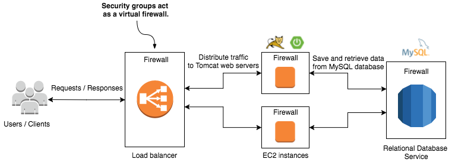

# How to properly setup a Spring Boot Application using CloudFormation
## Intro
The goal of this project is to give you a rocket start into AWS CloudFormation. It should lead you through the process of setting up a backend for yourself in only minutes. Adapting the template to other stacks/technologies should be as easy as possible. The focus lays on scalability and security. 

We are building a Spring Boot RESTful backend here using only AWS CloudFormation. We include a MySql database, to which our application automatically connects to.

We are always happy to get your support. If you find anything that could be better, we highly appreciate your feedback. :)

### Infrastructure


### How to start asap?
1. [Create an IAM User and setup the aws cli](http://docs.aws.amazon.com/cli/latest/userguide/cli-chap-getting-set-up.html)
1. Create a key called "keyToSuccess" in the [webinterface](https://console.aws.amazon.com/console/home) -> EC2 -> Key Pairs -> *Create Key Pair*
1. [Download the template](cf_template/template.json)
1. Open a terminal and insert: 
```bash
aws cloudformation create-stack --region us-east-1 --stack-name theStackIsBack --template-body file:///Users/PATH_TO_TEMPLATE/template.json --parameters ParameterKey=KeyName,ParameterValue=keyToSuccess ParameterKey=DBName,ParameterValue=TheDbName ParameterKey=DBPwd,ParameterValue=Th3P455w0rd ParameterKey=DBUser,ParameterValue=TheDbUser
```
1. Done

## Table of Contents
1. [Cloudformation Introction](doc/template-overview.md)
2. [Step-By-Step description of the template](doc/template-desc.md)
3. [The raw template](template/template.json)
4. [Cut out content that doesn't fit anymore and needs some love](doc/pleasemodernizeme.md)

